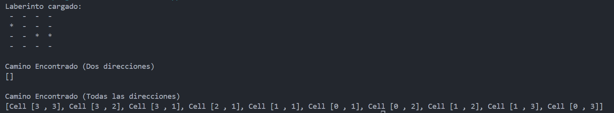

# Práctica - Programación Dinámica

## 📌 Informacion General

- **Título:** Programación Dinámica
- **Asignatura:** Estructura de Datos
- **Carrera:** Computación
- **Estudiante:** Brandon Collaguazo
- **Fecha:** 16/07/2025
- **Profesor:** Ing. Pablo Torres

---

### 🛠️ Descripción
Este proyecto en Java explora la implementación de algoritmos de programación dinámica, centrándose en la resolución de laberintos y el cálculo de la secuencia de Fibonacci. Se incluyen ejemplos prácticos que demuestran la aplicación de la programación dinámica para optimizar problemas comunes.

---

### 💡 Características
### Algoritmos Recursivos:
- Implementación de algoritmos recursivos para resolver laberintos, permitiendo movimientos en diferentes direcciones.
- MazeSolverRecursive: Resuelve laberintos permitiendo movimientos hacia abajo y hacia la derecha.
- MazeSolverRecursiveComplete: Resuelve laberintos permitiendo movimientos en todas las direcciones (arriba, abajo, izquierda, derecha).

### Estructura del Laberinto:
- Representación del laberinto mediante una matriz booleana, donde true indica un camino transitable y false una pared.

### Ejercicios de Programación Dinámica
- **Cálculo de Fibonacci:**
- Implementación de dos métodos para calcular la secuencia de Fibonacci:
- Recursión Simple: Método que calcula Fibonacci de forma recursiva sin optimización.
- Programación Dinámica (Memoización): Método que utiliza un HashMap para almacenar resultados intermedios y evitar recalculaciones, mejorando el rendimiento.

---

### 📦 Contenido
### Clases Principales
- **App.java:** Clase principal que ejecuta las demostraciones de resolución de laberintos y cálculo de Fibonacci.
- **Cell.java:** Representa una celda en el laberinto, con atributos para fila y columna.
- **Maze.java:** Representa la estructura del laberinto y contiene métodos para imprimirlo y obtener su matriz.
- **MazeSolver.java:** Interfaz que define el contrato para los solucionadores de laberintos.
- **MazeSolverRecursive.java:** Implementación de la interfaz que resuelve laberintos con movimientos limitados.
- **MazeSolverRecursiveComplete.java:** Implementación que permite movimientos en todas las direcciones.
- **EjerciciosPD.java:** Contiene métodos para calcular la secuencia de Fibonacci, tanto de forma recursiva como utilizando programación dinámica.

---

### 🚀 Resultados de ejecución

**Resultados obtenidos en la sesión de clases**

**Resultados de tarea**

---

**Autor:** Brandon Collaguazo
